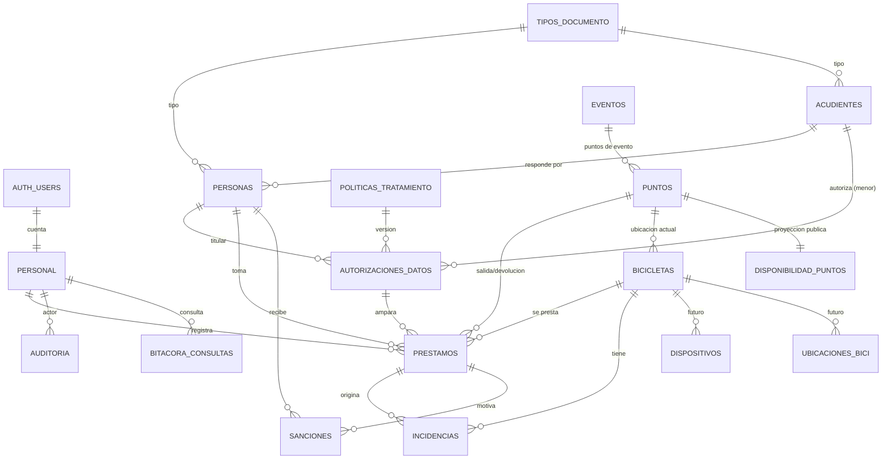

<!-- Diseño detallado generado por el agente Plan de Claude Code el 2026-10-07. Revisé las plantillas locales y verifiqué los hechos técnicos en la documentación oficial; las fuentes están en la sección 13. -->

# Plan de implementación: Bicis Públicas Valledupar (STTV)

## 0. Lo que cambia o condiciona las decisiones (leer primero)

1. **GitHub Pages y contraseñas.** GitHub dice textualmente: *"GitHub Pages sites shouldn't be used for sensitive transactions like sending passwords or credit card numbers."* Aquí las contraseñas y los datos van del navegador directo a Supabase por HTTPS; Pages solo sirve el JS estático. Aun así, la indicación existe.
   - No reabro la decisión de alojamiento.
   - Mitigación: autenticación en dos pasos en la cuenta de GitHub, rama `main` protegida y despliegue solo desde Actions.
   - El `dist/` se puede mover sin cambios a Cloudflare Pages o a un servidor institucional si TI o Jurídica lo objetan.
2. **Cambio de Supabase en 2026 sobre la Data API.** Los proyectos nuevos desde el 30-may-2026 ya no exponen automáticamente las tablas de `public`, y el 30-oct-2026 aplica a todos. Hay que dar permisos (GRANT) explícitos en cada migración. Lo trato como ventaja: obliga a declarar todo lo que se expone.
3. **Claves.** Las claves `anon`/`service_role` se deprecan a fines de 2026. Desde el día 1 se usan **publishable** (`sb_publishable_…`, va en el frontend) y **secret** (`sb_secret_…`, solo en Edge Functions y scripts locales).
4. **Riesgo legal de la foto (consultar a Jurídica).** El Decreto 1377/2013, art. 6, dice: *"Ninguna actividad podrá condicionarse a que el Titular suministre datos personales sensibles"*. Si la foto con el rostro se considera dato biométrico o sensible, exigirla para prestar sería un problema.
   - Esa interpretación jurídica **no la verifiqué**.
   - Diseño para que el cambio sea mínimo: consentimiento de la foto separado (`autoriza_foto`), finalidad y retención explícitas, instrucción al operador de no hacer primer plano del rostro, y la obligatoriedad vive en una sola línea de la función de préstamo.
5. **El borrado de fotos tiene que estar en el MVP, no en Fase 2.** Con unos 260 préstamos al día y unos 120 KB por foto, el GB gratuito se llena en unos 32 días.
6. **`supabase db dump` exige Docker** ("Runs pg_dump in a container"). Los respaldos se hacen con `pg_dump` nativo instalado desde conda-forge.
7. **El plan Free usa los 2 cupos de proyectos activos** (dev y prod) y no tiene respaldos. Para prod recomiendo presupuestar Pro (US$25/mes) antes del lanzamiento público. Es la mitigación más fuerte contra pérdida de datos y contra la pausa del proyecto.

---

## 1. Stack de frontend

| Criterio | Vue 3 + Vite | JS sin build (ES modules) | Alpine / petite-vue |
|---|---|---|---|
| ~25 pantallas, 3 roles, formularios en varios pasos | Reactividad y componentes de un solo archivo | Sincronizar el DOM a mano: frágil | Bien para detalles sueltos, flojo para una SPA |
| Curva para alguien que sabe HTML y Python | Plantillas parecidas al HTML; `<script setup>` | La menor al inicio, la mayor al mantener | Baja |
| Dependencias fijadas y seguras | `package-lock` + `save-exact` | CDN (cadena de suministro) o copiar librerías a mano | CDN |
| Configuración dev/prod | `import.meta.env` en el build | Manual | Manual |
| GitHub Pages | Build en Actions → estático | Directo | Directo |

**Decisión: Vue 3 + Vite, en JavaScript sin TypeScript.**
- Librerías: `vue-router` en modo hash (`createWebHashHistory`), sin Pinia (basta con composables), sin kit de interfaz (CSS propio con tokens).
- Leaflet, `@supabase/supabase-js` y `qrcode`.
- **El modo hash elimina el truco del 404.html.** Perjudica el SEO (lo dice la guía de Vue Router), pero solo importa para la portada, y esa sí se indexa.
- Descarto Streamlit, NiceGUI o cualquier opción en Python porque necesitan servidor y no caben en Pages.

Versiones en npm al 2026-10-07: vite 8.3.3 (exige node ^20.19 o ≥22.12; el local es 22.22.1, sirve), vue 3.5.43, vue-router 5.4.0, @vitejs/plugin-vue 6.0.9, @supabase/supabase-js 2.117.3, leaflet 1.9.4 (la misma que ya está copiada en ArcgisManage), qrcode 1.5.4, supabase (CLI) 2.120.0, @playwright/test 1.63.0 y vitest 5.0.3. Se fijan exactas en Fase 0.

## 2. Estructura del repo `bicis-publicas-valledupar`

Adaptación de `/nuevo-repo`:
- **Se conserva:** README.md, CLAUDE.md (Este proyecto / Estructura / Comandos frecuentes / Decisiones tomadas), `docs/`, `.gitignore` con `.env`, `git init` y el primer commit "Estructura inicial del repositorio".
- **Se omite:** `data/raw`, `notebooks/` y `outputs/`. No hay datasets, y los datos personales viven solo en Supabase.

```
bicis-publicas-valledupar/
├── README.md  CLAUDE.md  SECURITY.md  LICENSE (decidir; propongo MIT)
├── .gitignore  .npmrc (save-exact=true)  .nvmrc (22)  .githooks/pre-commit
├── package.json  package-lock.json  vite.config.js  index.html
├── sitio.config.js          # ÚNICO lugar: nombre "Bicis Públicas Valledupar", entidad, contacto, URL
├── public/  .nojekyll  robots.txt  favicon.svg  marca/logo_sttv.png
├── src/
│   ├── main.js  App.vue  router.js  config.js
│   ├── lib/        supabase.js uuid.js foto.js csv.js errores.js tiempo.js documento.js
│   ├── composables/ usePerfil.js useDisponibilidad.js useParametros.js usePuntoTrabajo.js useInactividad.js
│   ├── estilos/    tokens.css base.css fuentes/ (funnel-sans.woff2, acento-valledupar-italic.woff2 + OFL)
│   ├── componentes/ TecladoNumerico CapturaFoto TarjetaPersona MapaPuntos EtiquetaQR AvisoError …
│   └── vistas/     publico/ operador/ admin/
├── supabase/
│   ├── config.toml          # [functions.preinscribir] verify_jwt=false, etc.
│   ├── migrations/          # AAAAMMDDHHMMSS_descripcion.sql
│   └── functions/  preinscribir/ purgar-fotos/ _compartido/cors.ts
├── scripts/  migrar.sh  sembrar_dev.py  verificar_publicacion.py  respaldar_bd.sh  restaurar_prueba.sh  verificar_diseno.mjs
├── tests/  bd/ (pytest+psycopg)  test_contraste.py  test_verificacion.py  unit/ (vitest)  e2e/ (playwright)
├── docs/  requerimientos.md decisiones.md modelo-datos.md wireframes.md seguridad.md
│          operacion-operador.md runbook.md politica-tratamiento-v1.md paleta.md
├── environment.yml   # conda: python=3.12, postgresql=17.* (cliente y servidor para simulacros de restauración)
├── requirements-dev.txt  # pytest, psycopg[binary], pyyaml (versiones exactas)
└── .github/workflows/  ci.yml  desplegar.yml  mantener-activo.yml
```

**`.gitignore`:** `.env`, `.env.*` (menos `.env.example`), `node_modules/`, `dist/`, `supabase/.temp/`, `supabase/entornos.local.json`, `test-results/`, `playwright-report/`, `__pycache__/`, `*.csv`, `*.xlsx`, `*.dump*`, `*.sql.gz`, `capturas/`.
- Los respaldos van **fuera** del repo, en `~/Claude_code/respaldos-bicis/`, siguiendo la convención de `respaldos-portal`.

**Qué reutilizo de los repos locales:**
- De `ArcgisManage-rediseno/arcgis_manage/assets/`: el logo `logo_sttv.png` y las fuentes WOFF2 con sus OFL (ya están recortadas y renombradas como corresponde).
- `reports/tokens.py` → `src/estilos/tokens.css`, con el mismo principio: cada color se mide contra el peor fondo.
- `tests/test_contraste.py` → misma función WCAG, pero leyendo el `.css`.
- `publicacion/verificacion.py` → `scripts/verificar_publicacion.py`: el patrón de hallazgos con fragmento enmascarado y "huella", y las excepciones por huella.
- `scripts/verificar_diseno.mjs` → apuntado a las rutas hash de `vite preview` con anchos 320/390/1440 y Playwright fijado como devDependency, ya no la ruta global.

**Paleta cálida propuesta (tema claro; contraste calculado con la misma fórmula que el test):**

| Uso | Color | Contraste |
|---|---|---|
| Fondo "arena" | `#FBF7F0` | — |
| Banda | `#F3ECE0` | — |
| Tinta principal | `#221C17` | 15,8:1 |
| Tinta secundaria | `#5A4E44` | 7,5:1 / 6,9:1 sobre banda |
| Primario "mango" | `#B4460A` | blanco encima 5,5:1 |
| Hover | `#8F3707` | — |
| Secundario "Guatapurí" | `#0B6E64` | 6,1:1 |
| Disponible | `#1A7A3A` | 5,4:1 |
| Pocas | `#8A5A00` | 5,9:1 |
| Sin bicis | `#B3261E` | 6,5:1 |
| Sin dato | `#6B625A` | 6,0:1 |

- Todos los textos pasan 4,5:1 sobre fondo y banda.
- Los marcadores del mapa siempre llevan **el número impreso**, nunca solo color (daltonismo).
- **Tema oscuro fuera del MVP:** los operadores trabajan al sol.

## 3. Modelo de datos (SQL)

**Esquemas:**
- `public`: lo expuesto por la Data API, con RLS en todo y permisos explícitos.
- `privado`: no expuesto; funciones auxiliares, límites de tasa y registro de tareas.
- **Por qué:** las funciones SECURITY DEFINER auxiliares nunca deben vivir en un esquema expuesto (lo advierte la doc de RLS).

**Extensiones:** `citext`, `pg_cron`, `pg_net`. `gen_random_uuid()` es nativa.

**Migración 1, endurecimiento de privilegios:**
```sql
create schema privado;
revoke execute on all functions in schema public from public, anon, authenticated;
alter default privileges in schema public revoke execute on functions from public, anon, authenticated;
alter default privileges in schema public revoke all on tables from anon, authenticated;
```

**Enums** (estados explícitos, nunca deducidos de NULL):
```sql
create type rol_personal        as enum ('administrador','operador');
create type disponibilidad_bici as enum ('disponible','prestada','no_disponible');
create type condicion_bici      as enum ('operativa','averiada','en_reparacion','extraviada','baja');
create type tipo_punto          as enum ('fijo','evento','taller');
create type estado_punto        as enum ('activo','inactivo','oculto','cerrado');
create type estado_evento       as enum ('planeado','en_curso','finalizado','cancelado');
create type estado_inscripcion  as enum ('preinscrita','validada','anonimizada');
create type canal               as enum ('web','punto');
create type otorgante           as enum ('titular','acudiente');
create type estado_autorizacion as enum ('vigente','revocada');
create type estado_prestamo     as enum ('activo','finalizado','no_devuelto','anulado');
create type estado_foto         as enum ('almacenada','eliminada');
create type tipo_incidencia     as enum ('dano','accidente','perdida','robo','retraso','conducta','otro');
create type gravedad            as enum ('leve','moderada','grave');
create type estado_incidencia   as enum ('abierta','en_gestion','cerrada');
create type tipo_sancion        as enum ('amonestacion','suspension');
create type estado_sancion      as enum ('vigente','cumplida','anulada');
create type sexo_genero         as enum ('mujer','hombre','otro','prefiere_no_responder');
```

**Catálogos y personas:**
- `tipos_documento` (catálogo editable, no enum):
  - Columnas: `codigo pk` (CC, TI, CE, PPT, PA, PEP…), `nombre`, `familia` ('NUIP' para RC/TI/CC; las demás, su propio código), `implica_menor bool`, `patron text` (regex) y `activo`.
  - El UNIQUE va por `(familia, numero)`: así quien pasa de TI a CC con el mismo NUIP no queda duplicado (que el NUIP se comparte: **no verificado**, confirmar con la Registraduría).
- `acudientes`: `id uuid pk`, `tipo_documento fk`, `familia_documento`, `numero_documento`, `nombres`, `apellidos`, `telefono not null`, `correo citext`, `parentesco check in (...)`, con `unique(familia_documento, numero_documento)`. Que el acudiente sea adulto lo valida la función, no un CHECK.
- `personas`:
  - Columnas: `id uuid pk`, `tipo_documento fk`, `familia_documento` (la copia un trigger), `numero_documento check (~ '^[0-9A-Z]{3,20}$')` normalizado, `nombres`, `apellidos`, `telefono not null check (~ '^\+?[0-9]{7,15}$')`, `correo citext null`, `edad_declarada smallint check (between 5 and 110)`, `edad_declarada_en date not null`, `sexo_genero not null`, `acudiente_id fk null`, `estado estado_inscripcion default 'preinscrita'`, `origen canal`, `validada_en`, `validada_por fk personal`, `id_operacion uuid unique`, `creada_en`.
  - Restricciones: `unique (familia_documento, numero_documento)` y `check (estado <> 'validada' or (validada_en is not null and validada_por is not null))`.
  - Edad estimada = `edad_declarada + años transcurridos desde edad_declarada_en` (función `privado.edad_estimada`, ±1 año). Es menor si TI o si la edad estimada es menor de 18. Al validar, el operador puede volver a declarar la edad (queda auditado).
  - Decisión menor: teléfono obligatorio y correo opcional (muchos ciudadanos no tienen correo).

**Política de tratamiento y autorizaciones:**
- `politicas_tratamiento`:
  - Columnas: `id smallint identity`, `version unique`, `vigente_desde`, `texto_md`, `texto_autorizacion` (el texto exacto de la casilla), `sha256` (lo calcula un trigger), `vigente bool`, `publicada_por`, `publicada_en`.
  - `create unique index una_politica_vigente on politicas_tratamiento ((true)) where vigente;`
  - Un trigger impide editar el texto una vez publicada.
- `autorizaciones_datos`:
```sql
create table autorizaciones_datos(
  id uuid primary key,                       -- UUID del cliente
  persona_id uuid not null references personas,
  politica_id smallint not null references politicas_tratamiento,
  otorgada_por otorgante not null,
  acudiente_id uuid references acudientes,
  menor_escuchado boolean,                   -- Decreto 1377 art. 12 (derecho del menor a ser escuchado)
  autoriza_tratamiento boolean not null check (autoriza_tratamiento),
  autoriza_foto boolean not null,            -- separado a propósito (ver §0.4)
  canal canal not null, registrada_por uuid references personal,
  otorgada_en timestamptz not null default now(),
  estado estado_autorizacion not null default 'vigente', revocada_en timestamptz, motivo_revocacion text,
  check ((otorgada_por = 'acudiente') = (acudiente_id is not null)),
  check (otorgada_por = 'titular' or menor_escuchado is not null),
  check ((canal = 'punto') = (registrada_por is not null)),
  check ((estado = 'revocada') = (revocada_en is not null)));
create unique index una_autorizacion_vigente on autorizaciones_datos (persona_id, politica_id) where estado = 'vigente';
```

**Personal:**
- `personal`: `id uuid pk references auth.users(id) on delete restrict`, `nombre`, `rol rol_personal not null`, `activo bool`, `debe_cambiar_clave bool default true`, `creado_en`, `creado_por`.
- Un trigger impide quedarse sin administradores activos y que un administrador se degrade a sí mismo.
- Un solo campo de rol con 2 valores: nada de campos de privilegios ambiguos ni metadatos que el usuario pueda editar.

**Puntos, eventos y bicicletas:**
- `eventos`: `id`, `nombre`, `descripcion`, `lugar_texto`, `inicia_en`, `termina_en check (> inicia_en)`, `estado estado_evento`, `publicado bool`.
- `puntos`:
  - Columnas: `id uuid pk`, `codigo unique` (P01, E001, T01; estable, no se deriva del nombre), `nombre`, `tipo`, `estado default 'inactivo'`, `evento_id fk`, `latitud numeric(8,6)`, `longitud numeric(9,6)` (EPSG:4326, CHECK con un bbox amplio del municipio a definir con la capa oficial), `direccion`, `horario_texto`, `capacidad smallint null`, `notas_internas`.
  - `check ((tipo='evento') = (evento_id is not null))`.
- `bicicletas`:
```sql
create table bicicletas(
  id uuid primary key default gen_random_uuid(),
  numero integer not null unique check (numero between 1 and 9999),     -- sticker
  codigo text generated always as
    ('BPV-' || lpad(numero::text, greatest(3, length(numero::text)), '0')) stored unique,
  -- OJO: lpad TRUNCA; lpad('1000',3,'0') = '100'. El greatest() lo evita.
  -- El prefijo BPV es fijo: NO se deriva del nombre configurable.
  disponibilidad disponibilidad_bici not null default 'no_disponible',
  condicion condicion_bici not null default 'operativa',
  punto_actual_id uuid references puntos,
  marca text, modelo text, color text, talla text, numero_serie text unique, fecha_ingreso date,
  nota_operativa text, ultimo_movimiento_en timestamptz not null default now(),
  check (disponibilidad <> 'prestada' or (punto_actual_id is null and condicion = 'operativa')),
  check (disponibilidad = 'prestada' or condicion in ('extraviada','baja') or punto_actual_id is not null),
  check (disponibilidad <> 'disponible' or condicion = 'operativa'),
  check (condicion not in ('extraviada','baja') or disponibilidad = 'no_disponible'));
```

**Préstamos (el libro de préstamos):**
```sql
create table prestamos(
  id uuid primary key,                          -- UUID del cliente = llave de idempotencia
  bicicleta_id uuid not null references bicicletas,
  persona_id uuid not null references personas,
  autorizacion_id uuid not null references autorizaciones_datos,
  estado estado_prestamo not null default 'activo',
  punto_salida_id uuid not null references puntos,
  operador_salida_id uuid not null references personal,
  salida_en timestamptz not null default now(), salida_cliente_en timestamptz,
  edad_estimada smallint not null, es_menor boolean not null, acudiente_id uuid references acudientes,
  foto_ruta text not null check (foto_ruta ~ ('^prestamos/' || id::text || '/salida\.(webp|jpg)$')),
  foto_estado estado_foto not null default 'almacenada', foto_eliminada_en timestamptz,
  foto_retener boolean not null default false,
  observaciones_salida text,
  devolucion_id_operacion uuid unique, punto_devolucion_id uuid references puntos,
  operador_devolucion_id uuid references personal, devuelto_en timestamptz,
  con_novedad boolean, devolucion_forzada boolean not null default false, observaciones_devolucion text,
  cerrado_en timestamptz, cerrado_por uuid references personal, motivo_cierre text,   -- anulado / no_devuelto
  check (estado <> 'activo' or (devuelto_en is null and punto_devolucion_id is null and cerrado_en is null)),
  check (estado <> 'finalizado' or (devuelto_en is not null and punto_devolucion_id is not null
         and operador_devolucion_id is not null and con_novedad is not null and devolucion_id_operacion is not null)),
  check ((estado in ('anulado','no_devuelto')) = (cerrado_en is not null and length(motivo_cierre) >= 10)),
  check (devuelto_en is null or devuelto_en >= salida_en),
  check ((foto_estado = 'eliminada') = (foto_eliminada_en is not null)));
create unique index prestamos_un_activo_por_bici on prestamos (bicicleta_id) where estado = 'activo';
create index prestamos_activos_persona on prestamos (persona_id) where estado = 'activo';
create index prestamos_persona_fecha  on prestamos (persona_id, salida_en desc);
create index prestamos_salida         on prestamos (salida_en desc);
create index prestamos_fotos_purgables on prestamos (devuelto_en) where foto_estado = 'almacenada' and not foto_retener;
```

**Incidencias y sanciones:**
- `incidencias`:
  - Columnas: `id uuid pk`, `bicicleta_id not null`, `prestamo_id null`, `tipo`, `gravedad`, `descripcion check (length>=5)`, `deja_fuera_de_servicio bool`, `estado default 'abierta'`, `reportada_por`, `reportada_en`, `foto_ruta null`, `cerrada_por`, `cerrada_en`, `resolucion`.
  - `check ((estado='cerrada') = (cerrada_en is not null and resolucion is not null))`.
  - Índice parcial por bici `where estado <> 'cerrada'`: son las notas de daño que ve el siguiente operador.
  - Un trigger marca `prestamos.foto_retener = true` cuando la incidencia trae `prestamo_id`.
- `sanciones`:
  - Columnas: `id`, `persona_id`, `prestamo_id`, `incidencia_id`, `tipo`, `motivo`, `desde date`, `hasta date`, `estado`, `impuesta_por/en`, `anulada_por/en`, `motivo_anulacion`.
  - `check (tipo <> 'suspension' or hasta is not null)`: no hay suspensiones indefinidas implícitas.

**Parámetros (NULL = la regla no aplica):**
```sql
create table parametros(
  clave text primary key check (clave ~ '^[a-z_]+\.[a-z_]+$'),
  categoria text not null, descripcion text not null,
  tipo text not null check (tipo in ('entero','hora','booleano','texto')),
  unidad text, minimo numeric, maximo numeric, publico boolean not null,
  valor jsonb,                                   -- NULL = no aplica
  actualizado_en timestamptz, actualizado_por uuid references personal,
  check (valor is null
    or (tipo='entero'   and jsonb_typeof(valor)='number')
    or (tipo='hora'     and jsonb_typeof(valor)='string' and valor#>>'{}' ~ '^([01][0-9]|2[0-3]):[0-5][0-9]$')
    or (tipo='booleano' and jsonb_typeof(valor)='boolean')
    or (tipo='texto'    and jsonb_typeof(valor)='string')));
```
- La migración solo inserta **definiciones** con `valor = NULL`:
  - `reglas_uso.duracion_maxima_min`, `reglas_uso.max_prestamos_activos_persona`, `reglas_uso.max_prestamos_dia_persona`, `reglas_uso.edad_minima`
  - `horario.hora_inicio_prestamos`, `horario.hora_limite_prestamos`, `horario.hora_limite_devolucion`
  - `sanciones.tolerancia_retraso_min`, `sanciones.dias_suspension_por_retraso`, `sanciones.retrasos_para_suspension`, `sanciones.texto_reglamento`
  - `alertas.prestamo_largo_min`, `alertas.bici_inactiva_dias`
  - `retencion.fotos_dias`, `retencion.preinscripcion_sin_validar_dias`, `retencion.anonimizar_inactivos_meses`
- Un trigger valida `minimo`/`maximo`.

**Lo que ve el público (tabla de proyección):**
- `disponibilidad_puntos`: `punto_id pk fk`, `codigo`, `nombre`, `tipo`, `latitud`, `longitud`, `direccion`, `horario_texto`, `evento_nombre`, `abierto bool`, `bicis_disponibles int`, `visible bool`, `actualizado_en`.
- La mantienen triggers sobre `bicicletas`, `puntos` y `eventos` mediante `privado.refrescar_disponibilidad(punto_id)`, que solo escribe si el valor cambió (menos ruido en Realtime).
- Sin ninguna columna interna: por eso es una tabla dedicada y no columnas de `puntos` (Realtime manda la fila completa).

**Auditoría y trazabilidad:**
- `auditoria`: `id bigint identity`, `ocurrido_en`, `actor_id`, `tabla`, `operacion`, `registro_id`, `antes jsonb`, `despues jsonb` (solo las columnas que cambian), `accion text`, `motivo text`, `id_operacion`.
  - Trigger genérico `privado.auditar()`, AFTER INSERT/UPDATE/DELETE, en todas las tablas de negocio menos `disponibilidad_puntos`.
  - Las funciones del sistema hacen `set_config('app.accion','prestamo.anular',true)` y `set_config('app.motivo',…,true)`, y el trigger los recoge: anular, forzar o mover siempre queda auditado con su motivo.
  - En `personas` y `acudientes` la auditoría guarda **huellas** (sha256 truncado) de nombres, documento, teléfono y correo, no el valor: la bitácora no duplica datos personales.
  - Solo se agregan filas: REVOKE de UPDATE/DELETE/TRUNCATE a todos más un trigger que aborta.
- `bitacora_consultas`: `id`, `en`, `actor_id`, `tipo` ('buscar_persona', 'ver_persona', 'exportar'), `huella_documento`, `con_datos_personales bool`, `motivo`. Rastrea a quien consulte datos de forma masiva.
- `privado.ejecuciones_tareas`: tarea, inicio, fin, resultado y detalle (purgas, respaldos). Alimenta las alertas del tablero.
- `privado.limites_tasa`: `ip_hash`, `ventana`, `conteo`.

**GPS futuro (solo documentado; no se crea en el MVP):**
- `dispositivos(id, tipo check in ('rastreador','candado'), adaptador text /*'traccar','manual'*/, identificador_externo unique, bicicleta_id fk, activo, instalado_en)`.
- `ubicaciones_bici(id bigint identity, bicicleta_id, dispositivo_id null, fuente enum('sistema','operador','rastreador'), latitud, longitud, precision_m, reportada_en, recibida_en default now(), bateria_pct, unique(dispositivo_id, reportada_en))`.
- Partición mensual cuando crezca. La ubicación de una bici en uso es un dato personal: necesitará retención propia.

**Diagrama ER:**


## 4. Seguridad en Supabase

**Rol de la aplicación:**
- El JWT trae `role` (el rol de Postgres: `anon` o `authenticated`) y `sub` (= `auth.uid()`). **El rol de la aplicación no va en el JWT.**
- Se resuelve contra la tabla `personal`. Así revocar acceso tiene efecto inmediato, sin esperar a que el token expire, y no hace falta un hook de autenticación.
- Nunca se usa `user_metadata` para esto: el propio usuario lo puede editar (advertencia de la doc de RLS).
```sql
create function privado.rol_actual() returns public.rol_personal
  language sql stable security definer set search_path = '' as
$$ select rol from public.personal where id = (select auth.uid()) and activo $$;
create function privado.es_admin()    returns boolean language sql stable security definer set search_path = ''
  as $$ select coalesce(privado.rol_actual() = 'administrador', false) $$;
create function privado.es_personal() returns boolean language sql stable security definer set search_path = ''
  as $$ select privado.rol_actual() is not null $$;
grant usage on schema privado to authenticated;   -- lo necesitan las políticas; privado NO está expuesto por HTTP
grant execute on function privado.rol_actual(), privado.es_admin(), privado.es_personal() to authenticated;
-- En las políticas: using ((select privado.es_admin()))  ← el select evita evaluarla fila por fila
```

**Matriz RLS** (con GRANT explícito más una política por cada celda; nadie tiene DELETE sobre tablas de negocio):

| Tabla | anon | operador | admin |
|---|---|---|---|
| disponibilidad_puntos | SELECT `visible` | SELECT | SELECT |
| parametros | SELECT `publico` | SELECT | SELECT, UPDATE(valor) |
| eventos | SELECT `publicado` | SELECT | SELECT/INSERT/UPDATE |
| politicas_tratamiento, tipos_documento | SELECT | SELECT | SELECT (+UPDATE tipos) |
| puntos | — | SELECT | INSERT/UPDATE |
| bicicletas | — | SELECT | INSERT, UPDATE(solo columnas descriptivas) |
| personas, acudientes, autorizaciones | — | — (solo funciones con búsqueda exacta) | SELECT |
| prestamos | — | — (funciones) | SELECT (vista `v_prestamos_admin`, security_invoker) |
| incidencias | — | SELECT abiertas | SELECT/UPDATE |
| sanciones | — | — | SELECT/INSERT/UPDATE |
| personal | — | SELECT su propia fila | SELECT, UPDATE(rol, activo) |
| auditoria, bitacora_consultas | — | — | SELECT |

- La disponibilidad y la ubicación de una bici **solo cambian mediante funciones**: no hay UPDATE en esas columnas para nadie.

**Funciones del servidor (RPC):** todas SECURITY DEFINER con `set search_path = ''`, nombres de esquema completos, `revoke execute … from public, anon` y `grant` solo al rol que corresponde. Cada una arranca con `privado.exigir_rol(...)`.

**`registrar_prestamo` (atomicidad):**
1. Exige rol de operador o administrador.
2. Bloquea la bici con `select … from bicicletas where numero = $1 for update`.
3. **Verifica la idempotencia después de tomar el bloqueo.** Si ya existe un préstamo con `id = p_id` y los mismos parámetros, devuelve ese resultado; si los parámetros son otros, falla con `id_operacion_reutilizado`.
4. Bloquea la persona con `for update` (orden fijo bici → persona, para evitar interbloqueos).
5. Valida: bici disponible y en `p_punto_id`; punto activo; persona validada; autorización vigente de la **política vigente** con `autoriza_foto`; acudiente si es menor; sin sanción vigente.
6. Valida las reglas configurables **solo si el parámetro no es NULL**: máximo de préstamos activos y por día, edad mínima, horario en `(now() at time zone 'America/Bogota')::time`.
7. Comprueba que la foto ya existe en `storage.objects` (bucket `evidencias`).
8. Inserta el préstamo y actualiza la bici (`prestada`, punto NULL).
9. El índice único parcial es la última red de seguridad: un `unique_violation` se traduce a `bici_ya_prestada`.
10. Devuelve `{prestamo_id, codigo, salida_en, vence_en|null, ahora_servidor}`.
- Errores con `raise exception using message='<codigo>'`; `src/lib/errores.js` traduce cada código a un mensaje en español. Un código desconocido se muestra como error genérico y se registra; nunca se silencia.

**Las demás funciones:**
- `registrar_devolucion`: por número de bici.
- `preinscribir`: solo `service_role`.
- `registrar_persona_en_punto`, `validar_persona`, `registrar_autorizacion`.
- `anular_prestamo`, `forzar_devolucion`, `cerrar_no_devuelto`: admin, motivo de 10 caracteres o más, auditadas.
- `mover_bicis`: operador y admin, con motivo.
- `cambiar_condicion_bici`: admin; el operador solo puede marcar `averiada`.

**Storage:**
```sql
insert into storage.buckets (id, name, public, file_size_limit, allowed_mime_types)
values ('evidencias','evidencias', false, 524288, array['image/webp','image/jpeg']);  -- columnas: no verificadas; alternativa: crear el bucket desde el Dashboard
create policy evid_sube on storage.objects for insert to authenticated with check (
  bucket_id = 'evidencias' and (select privado.es_personal())
  and (storage.foldername(name))[1] in ('prestamos','incidencias'));
create policy evid_admin_lee on storage.objects for select to authenticated using (
  bucket_id = 'evidencias' and (select privado.es_admin()));
-- Sin UPDATE ni DELETE: subir sin sobrescribir; solo la Edge Function (clave secreta) borra.
```
- Subir solo exige INSERT (doc de control de acceso de Storage).
- Si se reintenta y el archivo ya existe (409), el cliente lo da por éxito: es idempotente por la ruta.

**Cuentas del personal sin SMTP:**
- El SMTP por defecto solo envía a miembros del equipo y como máximo 2 correos por hora (doc oficial). No sirve.
- **MVP:**
  - Desactivar "Allow new users to sign up".
  - Crear las cuentas en Dashboard → Authentication → Add user, marcando confirmación automática (la casilla exacta: **no verificada**).
  - El administrador las vincula en la app con `vincular_personal(correo, nombre, rol)`.
  - `debe_cambiar_clave` obliga a `auth.updateUser({password})` en el primer ingreso.
  - Si alguien olvida la clave, el administrador la restablece desde el Dashboard.
- **Fase 2:** Edge Function `gestionar-personal` con `auth.admin.createUser({email_confirm:true})` usando la clave secreta. Valida dentro del código que quien llama es administrador.
- **Sesión:** cierre por inactividad en el cliente (20 min en las vistas de operador y admin) y botón visible "Cerrar turno".
- **Fase 2:** TOTP para administradores (plan **no verificado**).

**Anti-spam y anti-enumeración de la preinscripción:** va en el **MVP**, como condición para abrir el formulario.
- `anon` **no** puede ejecutar `preinscribir`. Solo la Edge Function `preinscribir` (`verify_jwt=false`), que hace esto:
  1. Comprueba origen y CORS: solo `https://storreglosa.github.io` y localhost.
  2. Rechaza cuerpos mayores de 4 KB.
  3. Verifica el token de Turnstile en `siteverify` (válido 300 s, un solo uso), con `idempotency_key = id_operacion`.
  4. Calcula `ip_hash = HMAC(sal diaria, IP)` y aplica el límite de tasa en `privado.limites_tasa` (p. ej. 5 por hora y 20 por día por IP).
  5. Llama a la RPC con la clave secreta.
- Responde solo `{resultado: 'inscrito'|'ya_inscrito'}`:
  - Nunca devuelve datos ni distingue entre preinscrita y validada.
  - Si el documento ya existe, **no modifica nada**: así nadie sobrescribe el teléfono de otro.
- Turnstile es gratis (hasta 20 widgets, verificaciones ilimitadas).
- **Riesgo residual:** el mensaje "ya estás inscrito" sigue revelando si un documento está inscrito. Con Turnstile y límite de tasa, enumerar en masa no es práctico. Queda documentado.
- **Alternativa si Turnstile se retrasa:** abrir el piloto solo con inscripción en el punto (sesión de operador) y dejar el formulario público como "próximamente". Prefiero eso a exponer la función a `anon` "por un tiempo".

**Otras capas:**
- CSP en `<meta>` (Pages no permite cabeceras): `script-src 'self' https://challenges.cloudflare.com`; `connect-src https://<ref>.supabase.co wss://<ref>.supabase.co`; `img-src 'self' data: blob: https://tile.openstreetmap.org https://<ref>.supabase.co`; `style-src 'self' 'unsafe-inline'` (Leaflet usa estilos en línea).
- Nunca `v-html` con contenido del usuario.

## 5. API

| Endpoint | Entrada → salida | Rol |
|---|---|---|
| `GET /rest/v1/disponibilidad_puntos?visible=eq.true` | → puntos con conteo | anon |
| `GET /rest/v1/parametros?publico=eq.true` | → reglas (el front oculta las NULL) | anon |
| `GET /rest/v1/eventos?publicado=eq.true`, `/politicas_tratamiento?vigente=eq.true`, `/tipos_documento?activo=eq.true` | | anon |
| Realtime `postgres_changes` en `public.disponibilidad_puntos` | | anon |
| `POST /functions/v1/preinscribir` | `{id_operacion, persona, acudiente?, autorizacion{politica_version, otorgada_por, menor_escuchado?, autoriza_foto}, turnstile}` → `{resultado}` | anon (Turnstile) |
| `rpc/mi_perfil` | → `{id, nombre, rol, debe_cambiar_clave}` | authenticated |
| `rpc/buscar_persona` | `{p_tipo, p_numero}` (exacto) → resumen: nombre, documento enmascarado, estado, edad estimada, es_menor, acudiente (nombre/tel), autorización vigente sí/no, sanción, activos; además registra en la bitácora | operador, admin |
| `rpc/registrar_persona_en_punto` | `{p jsonb}` → `{persona_id}` (queda validada) | operador |
| `rpc/validar_persona` | `{p_persona_id, p_id_operacion, p_correcciones, p_autorizacion?}` | operador |
| `rpc/registrar_autorizacion` | nueva versión de la política | operador |
| `GET /rest/v1/bicicletas?punto_actual_id=eq.X&disponibilidad=eq.disponible` + `incidencias?estado=neq.cerrada` | | operador |
| `POST /storage/v1/object/evidencias/prestamos/{id}/salida.webp` | | operador |
| `rpc/registrar_prestamo` | `{p_id, p_persona_id, p_numero_bici, p_punto_id, p_foto_ruta, p_salida_cliente_en, p_observaciones}` | operador |
| `rpc/registrar_devolucion` | `{p_id_operacion, p_numero_bici, p_punto_id, p_con_novedad, p_incidencia?, p_observaciones}` → `{duracion_min, excedio?}` | operador |
| `rpc/prestamos_activos` | `{p_punto_id?}` → lista con nombre + inicial del apellido, código, salida_en, ahora_servidor | operador |
| `rpc/mover_bicis` | `{p_id_operacion, p_numeros[], p_punto_destino, p_motivo}` | operador, admin |
| REST CRUD sobre puntos, eventos, parametros (PATCH valor), bicicletas, personal, incidencias, sanciones; GET `v_prestamos_admin`, auditoria, bitacora_consultas, personas (paginado) | | admin |
| `rpc/crear_bicicletas {p_desde, p_hasta, p_punto_id}`, `vincular_personal`, `anular_prestamo`, `forzar_devolucion`, `cerrar_no_devuelto`, `cambiar_condicion_bici`, `cerrar_punto_evento` (exige 0 bicis), `publicar_politica`, `tablero_resumen {p_desde, p_hasta}`, `registrar_exportacion` | | admin |
| URL firmada `storage/v1/object/sign/evidencias/...` (60 s) | | admin |
| `rpc/fotos_por_purgar`, `marcar_fotos_eliminadas`, `fotos_huerfanas`, `registrar_tarea` | | service_role |
| `POST /functions/v1/purgar-fotos` (cabecera `x-clave-cron`) | | pg_cron |
| Fase 2: `/functions/v1/gestionar-personal`. Fase 3: `/functions/v1/gbfs/*`, `/functions/v1/ingesta-posiciones` (Traccar) | | |

- Una prueba automática de "superficie anónima" recorre `pg_proc` y `pg_class` con `has_function_privilege('anon',…)` y `has_table_privilege('anon',…)`. Falla si aparece cualquier cosa que no esté en la lista blanca.

## 6. Vistas y rutas (hash)

**Públicas:** `#/` (qué es y cómo funciona en 3 pasos), `#/mapa`, `#/reglas`, `#/eventos`, `#/inscribirme`, `#/politica-de-datos` (`/:version`), `#/b/:codigo` (destino del QR: información de la bici y cómo reportar un problema; no consulta la BD en el MVP), `#/ingresar`.

**Operador** (móvil primero; el punto de trabajo se elige al iniciar y se guarda en localStorage): `#/operador`, `#/operador/prestar`, `#/operador/devolver`, `#/operador/activos`, `#/operador/mover`.

**Admin:** `#/admin` (tablero), `/bicicletas`, `/bicicletas/:codigo`, `/puntos`, `/eventos`, `/personas`, `/personas/:id`, `/personal`, `/parametros`, `/prestamos` (historial con CSV), `/auditoria`, `/etiquetas`, `/politicas`.

Guardas de ruta con `meta.rol` y `mi_perfil()` en memoria. Leaflet y las vistas de admin se cargan con import dinámico.

**CSV:** se genera en el cliente con `'\uFEFF' + csv` (utf-8-sig), coma como separador (igual que `csv_export.py`) y fechas ISO. Por defecto va **seudonimizado**. Incluir datos personales exige un motivo y queda en `bitacora_consultas`.

**Etiquetas QR:** hoja A4 imprimible con CSS `@page`. El QR codifica `https://storreglosa.github.io/bicis-publicas-valledupar/#/b/BPV-015` más el código legible y el logo. El usuario imprime a PDF desde el navegador.

**Wireframe 1: mapa público (390 px)**
```
+--------------------------------------+
| [logo STTV] Bicis Públicas      Menu |
+--------------------------------------+
| (o) En vivo - actualizado 10:42      |
| +----------------------------------+ |
| |   [12]        [3]                | |
| |         [0]         [E 5]        | |
| |   (mapa Leaflet)    [Mi ubicación]| |
| +----------------------------------+ |
| [ Mapa | Lista ]   Filtro: Todos v   |
| Parque de la Leyenda        ABIERTO  |
|   12 bicis disponibles               |
|   Lun-Sáb 6:00-18:00  [Cómo llegar]  |
| Plaza Alfonso López         CERRADO  |
|   3 bicis disponibles                |
| EVENTO Ciclovía dom 12 oct           |
|   5 bicis disponibles                |
| +----------------------------------+ |
| | ¿Primera vez? Inscríbete en línea| |
| | y presenta tu documento al       | |
| | operador.     [ Inscribirme ]    | |
| +----------------------------------+ |
+--------------------------------------+
```

**Wireframe 2: prestar (operador, 4 pasos)**
```
Paso 1/4 Persona                  Punto: P03 Parque Leyenda
+--------------------------------------+
| Tipo [CC v]  Número [1065xxxxxx    ] |
| [1][2][3] [4][5][6] [7][8][9] [<][0] |
|              [ Buscar ]              |
| MARÍA P.  CC ****4567  34 años       |
| Estado: PREINSCRITA                  |
| [x] Vi el documento original y coincide |
| Edad declarada 34 [corregir]         |
| [ Validar y continuar > ]            |
| (si no existe) [ Inscribir aquí ]    |
| (si es menor) Acudiente: Ana P. 300..|
+--------------------------------------+
Paso 2/4 Bici
| Disponibles aquí (8): [007][012][015][033]... |
| N.º sticker [ 015 ]  ->  BPV-015              |
| ! Nota abierta: "timbre suelto" (leve)        |
| [ Continuar > ]                               |
Paso 3/4 Foto de evidencia
| [   TOMAR FOTO   ]  (vista previa)            |
| [Repetir]  [Usar foto]   Subida 92 KB  OK     |
Paso 4/4 Confirmar
| María P. - BPV-015 - P03 - salida 10:42       |
| Devolver antes de: 12:42 (solo si hay regla)  |
| [        PRESTAR        ]                     |
-> "Préstamo registrado. Entrega la BPV-015."
```
La devolución tiene 2 pasos: número de la bici (muestra persona y tiempo transcurrido) → [Sin novedad] grande o [Con novedad: tipo, descripción, foto opcional] → confirmar.

**Wireframe 3: tablero admin (1440 px)**
```
+ Bicis Públicas - Admin -------------------------------- [Vista operador] [Salir] +
| Tablero | Bicicletas | Puntos y eventos | Personas | Préstamos | Personal |      |
| Parámetros | Auditoría | Etiquetas QR                                          |
+-------------------------------------------------------------------------------+
| Periodo [Hoy | 7 días | 30 días]                                              |
| [Disponibles 96] [Prestadas 21] [No disponibles 13 (4 taller)] [Préstamos hoy 57] |
| ALERTAS                                                                       |
|  ! 3 préstamos superan la duración máxima                         [ver]       |
|  ! Retención de fotos sin configurar (retencion.fotos_dias vacío) [configurar]|
|  ! Fotos almacenadas: 412 MB de 1 GB  | BD: 38 MB de 500 MB                   |
|  ! Último respaldo: hace 9 días | Última purga: hoy 03:00 OK                  |
| +- Préstamos por hora (hoy) ----------+ +- Bicis por punto ------------------+ |
| | barras                              | | P01 12 | P03 8 | E001 5 | T01 4    | |
| +-------------------------------------+ +------------------------------------+ |
| Préstamos activos (21)                                           [CSV]        |
| Bici     Persona    Punto  Salida  Transcurrido                               |
| BPV-015  María P.   P03    10:42   1 h 05 min                                 |
+-------------------------------------------------------------------------------+
```

El tiempo transcurrido se calcula con el desfase respecto a `ahora_servidor` que devuelven las funciones, no con el reloj del celular.

## 7. Foto de evidencia y retención

**Captura:** `<input type="file" accept="image/*" capture="environment">`. Usa la cámara nativa en Android e iOS sin manejar permisos ni rarezas de `getUserMedia`.
- **Riesgo:** en celulares de gama baja el navegador puede cerrarse mientras la cámara está abierta. Antes de abrirla se guarda el borrador del préstamo (persona, bici, `id_operacion`) en `sessionStorage`.
- `getUserMedia` queda para Fase 2, junto con el escaneo de QR en la app.

**Compresión en el cliente (`src/lib/foto.js`):**
1. `createImageBitmap(file, {imageOrientation:'from-image'})`.
2. Lado mayor de 1280 px.
3. `canvas.toBlob('image/webp', 0.7)`. Si `blob.type` no es webp (Safari, **no verificado**), pasa a JPEG 0.75.
4. Si supera 150 KB, baja la calidad hasta 0.5.
- Objetivo de 80 a 150 KB.
- **Efecto útil:** el canvas elimina el EXIF, incluido el GPS del celular del operador.

**Capacidad:** 1 GB entre 120 KB da unas 8.300 fotos (unas 6.600 a 150 KB).
- En régimen estable: fotos guardadas ≈ préstamos por día × N + fotos conservadas por incidencia.
- Con un 80 % útil (800 MB), 120 KB y 260 préstamos por día, **N máximo ≈ 25 días**.
- `retencion.fotos_dias` tiene que estar definido antes de abrir: si es NULL no se borra nada, y el tablero lo alerta.

**Borrado:** borrar filas de `storage.objects` por SQL **no borra el archivo**, lo deja huérfano (doc oficial). Hay que usar la API de Storage (`remove`).
- **Decisión: pg_cron + pg_net + Edge Function**, todo dentro de Supabase. No uso GitHub Actions, porque los workflows programados se apagan a los 60 días y obligarían a guardar la clave secreta en GitHub.
- `cron.schedule('purgar-fotos', '0 8 * * *', …net.http_post(...))` corre a las 03:00 hora de Bogotá. La URL y la clave del cron van en Vault.
- `purgar-fotos` hace esto:
  1. `rpc fotos_por_purgar(500)`: préstamos `finalizado`, `con_novedad = false`, sin incidencias, `not foto_retener`, devueltos hace más de N días.
  2. `storage.remove(rutas)`.
  3. `rpc marcar_fotos_eliminadas(rutas)`.
  4. Huérfanas: objetos en `prestamos/` sin préstamo y con más de 24 h.
  5. Registra el resultado en `privado.ejecuciones_tareas`. Cualquier error queda registrado y se ve en el tablero.
- Otro job solo SQL purga las preinscripciones nunca validadas, si `retencion.preinscripcion_sin_validar_dias` no es NULL.

## 8. Tiempo real

- `alter publication supabase_realtime add table public.disponibilidad_puntos;` más `grant select … to anon` y la política `visible`.
- **Por qué `postgres_changes` y no broadcast:**
  - La doc recomienda broadcast por encima de unos 3.000 suscriptores, y el plan Free tope en 200 conexiones de todos modos.
  - `postgres_changes` aprovecha RLS sin políticas adicionales en `realtime.messages`.
  - La tabla no tiene ninguna columna privada.
- **En el cliente:**
  1. Carga inicial.
  2. Suscripción `event:'*'`.
  3. Al pasar a segundo plano se cancela la suscripción y al volver se recarga todo: ahorra conexiones y cubre el límite de 24 h de las conexiones públicas.
  4. Recarga completa cada 5 minutos. Cuando un punto pasa a no visible, RLS no entrega ese UPDATE a `anon`; la recarga lo corrige.
  5. Si el canal da `CHANNEL_ERROR` o `TIMED_OUT`, cambia a sondeo cada 60 s y muestra "actualizado hh:mm".
- Operador y admin **no** se suscriben: recargan tras cada operación, al recuperar el foco y cada 60 s. Así quedan conexiones libres para el público.

## 9. Desarrollo sin Docker

- **Proyectos:** `bicis-valledupar-dev` y `bicis-valledupar-prod`, en la región `us-east-1`.
  - Latencia razonable desde Colombia.
  - EE. UU. está en la lista de nivel adecuado de la SIC (Circular 005/2017, según fuente secundaria). Igual hace falta el DPA (acuerdo de tratamiento de datos) de Supabase como encargado y revisión de Jurídica.
  - Antes, confirmar que la organización no tenga otro proyecto Free activo.
- **CLI:** `supabase@2.120.0` como devDependency (`npx supabase`).
  - `migration new` y `link` no usan Docker (link usa el pooler por defecto y tiene `--skip-pooler`).
  - `db push`: la doc no exige Docker (`db pull` sí). **No verificado explícitamente**: se prueba en Fase 0 con `--dry-run` sobre una migración vacía.
  - Si falla: `psql -1 -f` por migración, más el registro en `supabase_migrations.schema_migrations`, dentro de `scripts/migrar.sh`.
  - `functions deploy --use-api` empaqueta sin Docker. `secrets set` no lo requiere.
  - `db dump` **sí** requiere Docker.
- **Wrapper:** `scripts/migrar.sh dev|prod` hace `link --project-ref` → `db push --dry-run` → muestra el proyecto → para prod exige escribir el ref → `db push`.
  - Regla en CLAUDE.md: **ningún cambio de esquema desde el Dashboard de prod**; todo es una migración que pasó por dev.
- **psql / pg_dump / psycopg:**
  - Entorno conda `bicis` con `postgresql=17.*` de conda-forge (la última es 18.6; fijar 17 para igualar el servidor, que en Supabase es PG17). La disponibilidad exacta de 17.x en conda-forge no la verifiqué.
  - Conexión por el **pooler de sesión, puerto 5432**: es IPv4. La conexión directa en Free es solo IPv6, algo problemático en WSL.
  - Las credenciales van en `~/.pg_service.conf` + `~/.pgpass` (chmod 600, fuera del repo), con servicios `bicis_dev` y `bicis_prod`. psql, pg_dump y psycopg los leen de forma nativa, sin `.env`, lo que encaja con tu hook.
- **Pruebas de BD (pytest + psycopg) contra dev:**
  - Fixture `como(rol, uid)`:
    1. `conn.transaction(force_rollback=True)`.
    2. `select set_config('request.jwt.claims', json, true)`.
    3. `set local role authenticated|anon`.
    - Es el mismo mecanismo que documenta Supabase, y no deja residuos.
  - Hay 3 usuarios de prueba creados una sola vez en dev (admin, operador1, operador2), con sus UUID en la configuración local.
  - Cobertura:
    - superficie anónima;
    - RLS por tabla y rol;
    - reglas de préstamo, incluida la de parámetro NULL que no aplica;
    - idempotencia;
    - **concurrencia**: dos conexiones; la segunda, con `lock_timeout='1s'`, espera el bloqueo de la primera, y una inserción doble directa provoca `unique_violation`;
    - auditoría y enmascaramiento;
    - selección de fotos a purgar.
  - Descarto `supabase test db --linked` porque no está claro si usa Docker.
- **Semilla:** `scripts/sembrar_dev.py --semilla 20261007` con `random.Random`.
  - Genera 130 bicis, 8 puntos fijos, 1 de evento, 1 taller, 300 personas ficticias (documentos con prefijo `00`, imposibles en la realidad) y 60 días de historial.
  - Se niega a correr si el ref de destino no es el de dev.
  - El repo no contiene números literales.
- **Pruebas e2e (Playwright 1.63.0, locales con `vite` contra dev):**
  - Mapa en vivo con dos contextos de navegador.
  - Preinscripción con las claves de prueba de Turnstile que siempre aprueban (**no verificadas**).
  - Prestar con `setInputFiles` de una imagen generada.
  - Devolver y anular.
  - Además `verificar_diseno.mjs` a 320, 390 y 1440 px.
- **vitest:** `foto.js`, `csv.js` (BOM), `documento.js` y `errores.js`.

## 10. Despliegue, respaldos y mantener activo el proyecto

**`desplegar.yml`** (push a main o manual):
1. checkout, setup-node 22, `npm ci`, `npm run build`, con `VITE_SUPABASE_URL`, `VITE_SUPABASE_PUBLISHABLE_KEY` y `VITE_TURNSTILE_SITE_KEY` como **variables** del entorno `github-pages` (son públicas; no son secretos).
2. `python scripts/verificar_publicacion.py dist`.
3. `configure-pages` → `upload-pages-artifact` → `deploy-pages`, con permisos `pages: write` e `id-token: write` y el entorno `github-pages`.
- Las actions se fijan por SHA y Dependabot las actualiza.
- `vite.config.js`: `base: '/bicis-publicas-valledupar/'`.
- En local, `.env.development.local` (en `.gitignore`) lleva solo la URL y la clave publishable de dev.

**`ci.yml`** (PR y push): build, vitest, `pytest tests/test_contraste.py tests/test_verificacion.py`, y el escáner sobre todo el árbol.
- Las pruebas de BD y e2e corren en local, en la lista de verificación de cada versión. Así no hay que poner credenciales de dev en GitHub.

**Escáner anti-datos-personales:** busca números de 7 a 10 dígitos (con lista blanca por huella para constantes como 6378137), correos fuera de la lista blanca, teléfonos, `sb_secret_`, JWT con `service_role`, `postgres://…:clave@` y archivos `.csv/.xlsx/.sql/.dump`.
- También como `.githooks/pre-commit` (`git config core.hooksPath .githooks`).

**Respaldos (no hay en Free):** `scripts/respaldar_bd.sh`:
1. `pg_dump service=bicis_prod -Fc -n public -n privado`.
2. Más `\copy (select id,email,created_at from auth.users)`.
3. Cifrado con `gpg --encrypt` (clave pública; el script no necesita frase de paso).
4. Destino: `~/Claude_code/respaldos-bicis/AAAA-MM-DD_bicis_prod.dump.gpg` y copia a almacenamiento institucional.
5. Se conservan 8 semanales y 12 mensuales.
6. Registra el éxito con una función, que alimenta "Último respaldo" en el tablero.
- **Programación:** WSL no corre cron sin systemd; se propone el Programador de tareas de Windows con `wsl.exe -e bash -lc …` (**no verificado** en tu máquina). Depende de que el PC esté encendido, y es frágil: otra razón para usar Pro en prod.
- **Simulacro trimestral:** restaurar en un Postgres local de conda (`initdb`/`pg_ctl` en el puerto 54329, con un `auth` mínimo de reemplazo) y contar filas. Nunca en dev, para no mezclar datos reales.
- Las fotos no entran en el dump; las conservadas por incidencia se exportan en Fase 2.

**Mantener activo el proyecto:**
- En prod, el uso diario de los operadores ya cuenta como actividad. La doc dice que bastan "a few user requests to the database each day".
- Para periodos sin operación: `mantener-activo.yml` con cron diario que hace un GET de `disponibilidad_puntos` con la clave publishable.
  - **Limitación:** en un repo público, los workflows programados se desactivan tras 60 días sin actividad en el repo.
  - Por eso el tablero muestra la fecha del último commit y hay recordatorio en el runbook.
  - Si se pausa, se restaura hasta 1 año después con los datos intactos.
- Dev se puede pausar sin problema.
- Si GET por PostgREST cuenta como "actividad": **no verificado** al detalle.

## 11. Fases

**Fase 0: fundamentos (≈1 semana)**
- Entregables:
  - Repo creado con la adaptación de `/nuevo-repo` y el primer commit.
  - `docs/requerimientos.md`, `decisiones.md` (ADR), `modelo-datos.md` (ER), `wireframes.md`, `seguridad.md` (matriz RLS) y `politica-tratamiento-v1.md` (borrador para Jurídica).
  - `tokens.css` + `test_contraste.py` en verde.
  - Tú haces: crear los 2 proyectos Supabase con la organización protegida con 2FA y, idealmente, un correo institucional como dueño; desactivar el registro público; crear el widget Turnstile; configurar `~/.pg_service.conf`.
  - Prueba de la CLI sin Docker: `link`, `db push --dry-run`, `psql` y `pg_dump` contra dev.
- **Punto de control C0:** apruebas ER, wireframes, paleta, matriz RLS y región; la política sale a Jurídica.

**Fase 1: MVP operable (≈5–6 semanas, un commit por hito)**
- 1a. Migraciones: esquema, RLS, funciones, auditoría y triggers de disponibilidad, con `pytest tests/bd` en verde. Commit: "Crea esquema de préstamos con RLS, auditoría y pruebas de concurrencia". **C1:** revisas el informe de pruebas.
- 1b. Interfaz base y páginas públicas: portada, reglas desde parámetros, política, mapa en vivo y `#/b/:codigo`.
- 1c. Operador: prestar, devolver (con novedad → incidencia), activos y mover; foto y Storage. **C2:** pruebas prestar y devolver en tu celular con datos ficticios.
- 1d. Admin básico:
  - `crear_bicicletas(1,130)`;
  - puntos y eventos con mapa;
  - parámetros con el interruptor "No aplica";
  - vincular personal;
  - búsqueda de personas;
  - historial con CSV;
  - lista de auditoría;
  - **etiquetas QR**;
  - tablero de conteos y alertas fijas (préstamo que pasa de la duración máxima si está definida, retención sin configurar, Storage y BD, último respaldo y última purga).
  - **C3:** imprimes etiquetas en papel real y pruebas tamaño y lectura.
- 1e. Preinscripción pública con Edge Function, Turnstile y límite de tasa.
- 1f. Retención automática de fotos (pg_cron + `purgar-fotos`).
- 1g. Despliegue en Pages, CSP, escáner, respaldo semanal y simulacro de restauración hecho.
- **C4, decisión de piloto:** política aprobada por Jurídica; parámetros definidos, incluido `retencion.fotos_dias`; cuentas creadas; respaldo restaurado; decisión Pro o Free. Piloto cerrado: 2 operadores, 10–20 bicis, 2–4 semanas.
- **C5:** revisión del piloto → lanzamiento público.

**Fase 2:** escaneo de QR en la app (`qr-scanner` o BarcodeDetector; en iOS no hay BarcodeDetector, así que se usa la librería); módulo completo de incidencias; sanciones (manuales primero, luego automáticas por parámetros); panel de alertas (préstamo largo, bici inactiva, consultas anómalas por operador); tablero con series por día, hora y punto y agregados de edad y sexo; `gestionar-personal`; anonimización y derechos del titular (Ley 1581: consulta, corrección, supresión); exportar fotos conservadas; TOTP para administradores; SMTP institucional opcional.

**Fase 3:** modo sin conexión (PWA + cola en IndexedDB; los UUID de cliente ya dan la idempotencia); cuentas ciudadanas; GPS (`dispositivos` y `ubicaciones_bici`, con Traccar reenviando por HTTP a `ingesta-posiciones`); migración a alojamiento institucional (Supabase autoalojado: su docker-compose pasa a PG17 desde jun-2026; o Postgres + PostgREST); datos abiertos agregados y **GBFS 3.0**.

**Crítica de alcance:**
- **Sale del MVP:** escaneo de QR en la app (teclear 3 dígitos del sticker es más rápido), creación de personal con Edge Function (el Dashboard basta para unas 10 cuentas), sanciones, tema oscuro, tablas GPS (solo documentadas).
- **Pasa a Fase 3:** GBFS. Solo sirve si alguien lo consume.
- **Entra al MVP:** retención de fotos (Storage se llena en un mes), respaldos, Turnstile, auditoría y CSP. Son baratos, y no tenerlos es caro.
- **Lo que sí evitaría simplificar:** tener `eventos` como tabla aparte. Una ciclovía puede tener varios puntos.

## 12. Riesgos y mitigaciones

| Riesgo | Mitigación |
|---|---|
| Escalada de privilegios o fuga por RLS | Rol en tabla, no en metadatos; GRANT explícito + RLS; funciones con `search_path=''`; prueba de superficie anónima en CI local; sin DELETE |
| Clave secreta filtrada | Solo en los secretos de Supabase y en `~/.pgpass`/local; escáner de `sb_secret_`; rotación descrita en el runbook (las claves nuevas se rotan sin cortar el servicio) |
| Datos de menores | Campos mínimos; acudiente obligatorio con `menor_escuchado`; solo búsqueda exacta para operadores; bitácora de consultas; purga de preinscripciones no validadas; auditoría con huellas; **la foto como posible dato sensible va a Jurídica**; registro de la base en el RNBD si aplica a entidad pública (**no verificado**, confirmar con Jurídica); transmisión a Supabase cubierta por DPA y declarada en la política |
| Enumeración de documentos | Edge Function + Turnstile + límite por IP con hash; respuesta sin datos; sin modificar el registro existente; riesgo residual documentado |
| Doble préstamo concurrente | `FOR UPDATE` + idempotencia verificada después del bloqueo + índice único parcial + prueba |
| Pausa del proyecto | Uso real + ping diario + aviso del tablero; Pro en prod |
| Pérdida de datos | pg_dump semanal cifrado fuera del repo + simulacro; auditoría solo de inserción; anulación en vez de borrado; migraciones versionadas; Pro (respaldos diarios) |
| Storage lleno | Compresión a ≤150 KB, purga diaria, huérfanas, alerta al 70 % |
| Robo o pérdida de bicis | Identidad validada en persona, foto, acudiente, estado `no_devuelto` + incidencia `robo` + sanción; inventario por sticker/QR; alertas de préstamo largo; GPS a futuro |
| Directriz de GitHub Pages sobre contraseñas | 2FA, rama protegida, despliegue solo por Actions; `dist/` portable a otro alojamiento |
| Dependencia de una sola persona (repo y organización a nombre personal) | Organización de GitHub de la STTV o transferencia posterior; organización Supabase con correo institucional como dueño; runbook |
| Tabletas compartidas | Cierre por inactividad, "Cerrar turno", nada sensible en localStorage |

## 13. Verificación de hechos (fuentes)

**Verificado en documentación oficial:**
- `db dump` exige Docker: https://supabase.com/docs/reference/cli/supabase-db-dump
- `db push`: banderas `--db-url`, `--linked`, `--dry-run`; `db pull` exige Docker: https://supabase.com/docs/reference/cli/supabase-db-push
- `functions deploy --use-api` sin Docker: https://supabase.com/docs/reference/cli/supabase-functions-deploy
- Secretos y variables por defecto de Edge Functions: https://supabase.com/docs/guides/functions/secrets
- Claves publishable/secret; anon y service_role deprecadas a fines de 2026; límite de 24 h en Realtime público: https://supabase.com/docs/guides/api/api-keys
- Tablas no expuestas por defecto (30-may y 30-oct-2026): https://supabase.com/changelog/45329-breaking-change-tables-not-exposed-to-data-and-graphql-api-automatically
- Borrar por SQL deja huérfano el archivo: https://supabase.com/docs/guides/storage/management/delete-objects
- Políticas de Storage: https://supabase.com/docs/guides/storage/security/access-control
- `postgres_changes`: RLS, hilo único, umbral de unos 3.000 suscriptores, DELETE sin RLS: https://supabase.com/docs/guides/realtime/postgres-changes
- Broadcast desde la BD: https://supabase.com/docs/guides/realtime/broadcast
- pg_cron + pg_net + Vault: https://supabase.com/docs/guides/functions/schedule-functions y https://supabase.com/docs/guides/cron
- Límites del SMTP por defecto: https://supabase.com/docs/guides/auth/auth-smtp
- `user_metadata` editable, `(select …)`, SECURITY DEFINER fuera de esquemas expuestos: https://supabase.com/docs/guides/database/postgres/row-level-security
- EXECUTE por defecto y cómo revocarlo: https://supabase.com/docs/guides/database/functions
- IPv6 en la conexión directa, pooler de sesión en IPv4: https://supabase.com/docs/guides/database/connecting-to-postgres
- Free: 500k invocaciones, sin transformación de imágenes, 2M mensajes Realtime: https://supabase.com/pricing
- Restauración hasta 1 año tras la pausa: https://supabase.com/docs/guides/platform/free-project-pausing
- pg_dump nativo y Storage fuera del respaldo: https://supabase.com/docs/guides/platform/migrating-within-supabase/backup-restore
- Simular usuario en pruebas: https://supabase.com/docs/guides/local-development/testing/overview
- PG17 por defecto y en el autoalojado: https://supabase.com/changelog/46080-self-hosted-supabase-upgrading-from-pg-15-to-17-breaking-change
- Workflows programados desactivados a los 60 días: https://docs.github.com/en/actions/managing-workflow-runs-and-deployments/managing-workflow-runs/disabling-and-enabling-a-workflow
- Workflow de despliegue en Pages: https://docs.github.com/en/pages/getting-started-with-github-pages/using-custom-workflows-with-github-pages
- Límites de Pages y "sensitive transactions": https://docs.github.com/en/pages/getting-started-with-github-pages/github-pages-limits
- Modo hash y SEO: https://router.vuejs.org/guide/essentials/history-mode.html
- Turnstile: verificación en servidor y plan gratuito: https://developers.cloudflare.com/turnstile/get-started/server-side-validation/ y https://developers.cloudflare.com/turnstile/plans/
- conda-forge postgresql (última 18.6): https://anaconda.org/conda-forge/postgresql
- Decreto 1377/2013, art. 6: https://www.funcionpublica.gov.co/eva/gestornormativo/norma.php?i=53646
- SIC Circular 005/2017 incluye a EE. UU. (fuente secundaria): https://www.hklaw.com/en/insights/publications/2017/08/cambios-en-la-transferencia-de-datos-personales-a

**No verificado** (confirmar en Fase 0 o con Jurídica):
- `db push` sin Docker de forma explícita.
- La casilla de confirmación automática en "Add user".
- Las columnas `file_size_limit` y `allowed_mime_types` al crear el bucket por SQL.
- pg_cron en Free (la doc no restringe por plan).
- Codificación WebP en Safari.
- Si un GET cuenta como actividad contra la pausa.
- Las claves de prueba de Turnstile.
- Que el NUIP se comparta entre RC, TI y CC.
- La obligación de registro en el RNBD.
- La foto como dato sensible.
- Que una función SECURITY DEFINER pueda leer `storage.objects` (casi seguro; habrá prueba).
- La programación de tareas desde WSL.
- TOTP en Free.
- La disponibilidad exacta de 17.x en conda-forge.

### Archivos clave para la implementación
- /home/storreglosa/Claude_code/bicis-publicas-valledupar/supabase/migrations/ (esquema, RLS, `registrar_prestamo`/`registrar_devolucion`, auditoría, Storage, cron), por crear
- /home/storreglosa/Claude_code/bicis-publicas-valledupar/tests/bd/conftest.py (fixture `como(rol, uid)` con rollback), por crear
- /home/storreglosa/Claude_code/bicis-publicas-valledupar/src/vistas/operador/Prestar.vue y /home/storreglosa/Claude_code/bicis-publicas-valledupar/src/lib/foto.js, por crear
- /home/storreglosa/Claude_code/ArcgisManage-rediseno/arcgis_manage/publicacion/verificacion.py (base del escáner anti-datos-personales)
- /home/storreglosa/Claude_code/ArcgisManage-rediseno/tests/test_contraste.py y /home/storreglosa/Claude_code/ArcgisManage-rediseno/arcgis_manage/reports/tokens.py (base de tokens y contraste); además /home/storreglosa/Claude_code/ArcgisManage-rediseno/arcgis_manage/assets/ (logo, Leaflet 1.9.4, fuentes OFL) y /home/storreglosa/Claude_code/ArcgisManage-rediseno/scripts/verificar_diseno.mjs
