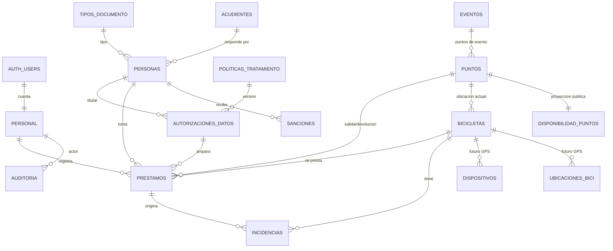

# Plan — Bicis Públicas Valledupar (web de gestión, desde cero)

## Contexto
La STTV tiene 130 bicicletas para un sistema de bicicletas públicas (puntos fijos + eventos) y no tiene página
ni app para gestionarlo. Se construye una web propia que: muestre el sistema, registre cada préstamo y
devolución con evidencia, lleve el historial completo y muestre los puntos con disponibilidad en tiempo real.
Hoy no hay GPS ni pagos; el diseño queda listo para GPS. **Resultado: la página publicada y operable**, por
fases, con una demo con datos ficticios publicada temprano para poder mostrarla.

Insumos: referencia de Perplexity aportada por Santiago + tres investigaciones de esta sesión
(OSBS/OpenBike, GBFS/casos/normativa, entorno local) + diseño detallado del agente Plan.
**Respaldo del diseño completo (SQL, matriz RLS, fuentes):**
`~/.claude/projects/-home-storreglosa-Claude-code/f86c982f-e37b-4046-aec3-b77d5118225a/tool-results/toolu_01G7CDKPguMojwZh12zJboJy.json`
(los informes de investigación están en el transcript de esta misma sesión, `.../f86c982f-….jsonl`).
Primer paso de la ejecución: volcarlos a `docs/` del repo (el scratchpad se borra al reiniciar).

## Decisiones tomadas con Santiago (2026-10-07)
| Tema | Decisión |
|---|---|
| Préstamo | **Asistido por operador**: verifica el documento **por exhibición (nunca lo retiene**, D. 2150/1995 art. 18) y registra préstamo/devolución desde celular/tableta. |
| Puntos | **Fijos y de evento** (los de evento cuelgan de un evento y se cierran con él). |
| Inscripción | **Preinscripción web sin cuenta + validación presencial** en el primer préstamo; también inscripción directa en el punto. Si el documento ya existe: mensaje amable "ya estás inscrito, acércate a un operador". |
| Datos | Nombre, tipo/n.º de documento, teléfono, correo (opcional), **edad declarada + fecha de declaración**, **sexo/género**. Menor (TI, o edad estimada < 18) → **acudiente** con identificación y contacto, que autoriza. |
| Foto | **Obligatoria, usuario con la bici**, en cada préstamo. Implementada como parámetro `evidencia.foto_persona_obligatoria = true`: si Jurídica la objeta (posible dato sensible, D. 1377 art. 6), se cambia a "foto solo de la bici" sin tocar código. Borrado automático N días tras devolución sin novedad; se conserva si hay incidencia. |
| Reglas de uso | **Solo configurables** (duración, horarios, límites, sanciones): NULL = la regla no aplica. |
| Roles | **Administrador** y **Operador** (funcionarios/contratistas STTV). |
| Flota | Sticker 1–130 → código `BPV-001…BPV-130` + **etiquetas QR imprimibles**. |
| Identidad | Nombre provisional **"Bicis Públicas Valledupar"** (un solo archivo de configuración), logo STTV existente, **paleta cálida propia** con contraste WCAG verificado. |
| Alojamiento | **GitHub Pages (repo público) + Supabase plan Free, región EE. UU.** (país con nivel adecuado según la SIC). Alojamiento institucional → backlog. |
| Alcance MVP | En línea (UUID de cliente para habilitar offline después); **sin cuenta ciudadana**. |

## Hallazgos que condicionan el diseño
- **Supabase Free** (pricing, verificado): 500 MB BD, 1 GB Storage, 2 proyectos, 200 conexiones Realtime,
  **sin backups**, **pausa tras 7 días sin actividad** (restaurable). Cambios 2026: tablas de `public` ya no se
  exponen solas (GRANT explícito); claves **publishable/secret** reemplazan anon/service_role; el SMTP por
  defecto no sirve para enviar correos a terceros → cuentas del personal creadas desde el Dashboard.
- **Entorno**: sin Docker en WSL ni Postgres → dos proyectos en la nube (dev/prod), CLI con `npx supabase`
  (`db push`; `db dump` sí exige Docker) y `psql`/`pg_dump` vía conda-forge. Node 22, Python 3.14 (miniconda).
- **OSBS** (activo, GPL): sirve como referente operativo, no como código. Evitar sus fallas: sin claves foráneas ni
  transacciones (doble préstamo), estado deducido de NULL, privilegios ambiguos. **OpenBike** (abandonado):
  adoptar su modelo escalable a GPS (disponibilidad ≠ condición física; ubicaciones con fuente; dispositivos).
- **Normativa** (requisitos derivados que entran al MVP): autorización previa no premarcada con versión de
  política, fecha, canal y quién autoriza (Ley 1581 arts. 9 y 12; D. 1377); para menores, la autoriza el representante y
  queda constancia de que se escuchó al menor (D. 1377 art. 12); minimización; pie de página con Términos,
  Política de datos, Derechos de autor y canal PQRSD; WCAG 2.1 AA; logs de auditoría y respaldos (Res. MinTIC
  1519/2020, Anexos 1–3); normas del ciclista visibles (Ley 769 arts. 94–95, Ley 1811/2016, Ley 2486/2025: 1,50 m).
- **Antecedente local**: en 2023 Valledupar reactivó un programa con 2 biciestaciones (valleduparvaenbici.com,
  hoy caído). Casos comparables: EnCicla (estaciones manuales), Megabici y BiSinú (130 bicis, asistido).

## Arquitectura
```
Navegador (ciudadano / operador / admin)
  └─ SPA estática Vue 3 + Vite ── GitHub Pages (HTTPS, rutas hash)
       ├─ supabase-js ──► Supabase (us-east-1)
       │     Postgres 17 + RLS · funciones RPC (préstamo/devolución atómicos) · Auth (solo personal)
       │     Realtime (disponibilidad pública) · Storage privado (fotos) · pg_cron (retención)
       │     Edge Functions: preinscribir (Turnstile + límite de tasa), purgar-fotos
       └─ Cloudflare Turnstile (anti-spam de la preinscripción)
```
**Stack** (versiones exactas se fijan en Fase 0): Vue 3 + Vite (JavaScript, sin TS), vue-router en modo hash,
supabase-js, Leaflet 1.9.4, qrcode; Vitest + Playwright; pytest + psycopg para la BD. Python solo en scripts y pruebas.
Motivo: SPA con formularios, sesión, tiempo real y mapa; Vue tiene plantillas cercanas al HTML y Pages solo sirve estático.

## Estructura del repo `~/Claude_code/bicis-publicas-valledupar` (adaptación de `/nuevo-repo`)
```
README.md CLAUDE.md SECURITY.md LICENSE(MIT) .gitignore .npmrc .nvmrc .githooks/pre-commit
package.json package-lock.json vite.config.js index.html sitio.config.js   ← nombre/contacto en un solo lugar
public/ (.nojekyll, favicon, marca/logo_sttv.png)
src/ main.js App.vue router.js lib/ composables/ estilos/(tokens.css, fuentes OFL) componentes/ vistas/{publico,operador,admin}
supabase/ config.toml migrations/ functions/{preinscribir,purgar-fotos}
scripts/ migrar.sh sembrar_dev.py verificar_publicacion.py respaldar_bd.sh verificar_diseno.mjs
tests/ bd/ (pytest) unit/ (vitest) e2e/ (playwright) test_contraste.py
docs/ requerimientos.md decisiones.md modelo-datos.md wireframes.md seguridad.md diseno-detallado.md
      investigacion/ politica-tratamiento-v1.md runbook.md operacion-operador.md
environment.yml (conda: python, postgresql 17)  requirements-dev.txt
.github/workflows/ ci.yml desplegar.yml mantener-activo.yml
```
Sin `data/raw`, `notebooks` ni `outputs`: no hay datasets y los datos personales viven solo en Supabase.
`.gitignore`: `.env*` (menos `.env.example`), `node_modules/`, `dist/`, `*.csv`, `*.xlsx`, `*.dump*`, `supabase/.temp/`.
Respaldos fuera del repo: `~/Claude_code/respaldos-bicis/`.

**Reutilización** desde `~/Claude_code/ArcgisManage-rediseno/`: `arcgis_manage/assets/logo_sttv.png` y fuentes
WOFF2 OFL; `arcgis_manage/reports/tokens.py` → `tokens.css`; `tests/test_contraste.py` → contraste sobre el CSS;
`arcgis_manage/publicacion/verificacion.py` → escáner anti-datos-personales (CI + pre-commit);
`scripts/verificar_diseno.mjs` → verificación a 320/390/1440 px. Patrón Pages de `~/Claude_code/reportes-sttv`.

## Modelo de datos (resumen; SQL completo en `docs/diseno-detallado.md`)

Claves del diseño:
- **Estados explícitos (enums), nunca deducidos de NULL**. `bicicletas`: `numero` 1–130 único, `codigo` generado
  `BPV-###`, `disponibilidad` (disponible/prestada/no_disponible) separada de `condicion` (operativa/averiada/
  en_reparacion/extraviada/baja), `punto_actual_id`, con CHECKs de coherencia.
- **`prestamos` = libro de préstamos**: `id` UUID del cliente (idempotencia), estado (activo/finalizado/
  no_devuelto/anulado), salida y devolución emparejadas en la misma fila, foto (`foto_ruta`, `foto_estado`,
  `foto_retener`), edad estimada y acudiente al momento. **Índice único parcial: un solo préstamo activo por bici.**
- `personas` (UNIQUE por familia+número de documento; estado preinscrita/validada/anonimizada), `acudientes`,
  `tipos_documento` (catálogo; `implica_menor`), `politicas_tratamiento` (versionada, inmutable una vez
  publicada) y `autorizaciones_datos` (no premarcada, `autoriza_foto`, `menor_escuchado`, canal, quién registra).
- `puntos` (código estable P01/E001/T01, tipo fijo/evento/taller, estado, lat/lon EPSG:4326 con 6 decimales),
  `eventos`, `incidencias` (las abiertas se le muestran al siguiente operador), `sanciones`.
- `parametros` (clave, tipo, mín/máx, público, `valor jsonb` NULL = no aplica). Solo definiciones sin valor, salvo
  `evidencia.foto_persona_obligatoria = true`.
- `disponibilidad_puntos`: tabla de proyección **sin datos personales**, mantenida por triggers, que es lo único que ve el público y lo
  que transmite Realtime. Lista para generar GBFS 3.0 (estaciones virtuales) en el futuro.
- `auditoria` solo de inserción (trigger genérico; registra el motivo en anular/forzar/mover; guarda huellas en vez de datos
  personales) y `bitacora_consultas` (búsquedas y exportaciones con datos personales).
- GPS futuro (solo documentado): `dispositivos` y `ubicaciones_bici` con `fuente` (sistema/operador/rastreador);
  Traccar como pasarela.

## Seguridad
- Rol resuelto contra la tabla `personal` (nunca `user_metadata`); helpers `privado.es_admin()/es_personal()` en
  esquema **no expuesto**; RLS + GRANT explícito en todo; nadie borra tablas de negocio (se anula).
- **anon** solo ve `disponibilidad_puntos` (visibles), parámetros públicos, eventos publicados, política vigente,
  tipos de documento; **no** ejecuta RPC: la preinscripción pasa por la Edge Function `preinscribir`
  (CORS restringido + Turnstile + límite de tasa por IP con hash + respuesta solo `inscrito|ya_inscrito`, sin modificar
  registros existentes). Prueba automática de "superficie anónima" contra una lista blanca.
- **Operador**: solo búsqueda exacta por documento (`buscar_persona`, queda en la bitácora) y RPC de operación.
  **Admin**: CRUD y vistas completas.
- `registrar_prestamo` atómica: `FOR UPDATE` sobre bici→persona, idempotencia tras el bloqueo, validaciones
  (bici disponible en el punto, persona validada, autorización vigente, acudiente si es menor, sin sanción, reglas
  solo si el parámetro no es NULL, foto ya subida); `unique_violation` → `bici_ya_prestada`. Errores con códigos
  traducidos en `src/lib/errores.js` (nunca silenciados).
- Storage: bucket privado `evidencias`; el personal sube sin sobrescribir; solo el admin lee (URL firmada de 60 s); solo
  la Edge Function borra. La compresión en el cliente elimina el EXIF.
- Personal: registro público desactivado; cuentas creadas en el Dashboard + `vincular_personal`; cambio de
  clave obligatorio al primer ingreso; cierre por inactividad (20 min) y "Cerrar turno".
- CSP en `<meta>`, sin `v-html` con datos de usuario; 2FA en GitHub y Supabase; despliegue solo desde Actions.

## API (vistas PostgREST + RPC + Edge Functions)
| Rol | Endpoints |
|---|---|
| anon | GET `disponibilidad_puntos`, `parametros?publico`, `eventos?publicado`, `politicas_tratamiento?vigente`, `tipos_documento`; Realtime sobre `disponibilidad_puntos`; POST `functions/v1/preinscribir` |
| operador | `mi_perfil`, `buscar_persona`, `registrar_persona_en_punto`, `validar_persona`, `registrar_autorizacion`, `registrar_prestamo`, `registrar_devolucion` (con novedad → incidencia), `prestamos_activos`, `mover_bicis`; subida a `evidencias/prestamos/{id}/salida.webp` |
| admin | CRUD de puntos, eventos, bicicletas, parámetros, personal, incidencias, sanciones; `crear_bicicletas(1,130)`, `vincular_personal`, `anular_prestamo`, `forzar_devolucion`, `cerrar_no_devuelto`, `cambiar_condicion_bici`, `cerrar_punto_evento`, `publicar_politica`, `tablero_resumen`, `registrar_exportacion`; lectura de `v_prestamos_admin`, `auditoria`, `bitacora_consultas`; URL firmada de fotos |
| pg_cron / secret | `functions/v1/purgar-fotos`, `fotos_por_purgar`, `marcar_fotos_eliminadas` |

## Vistas (rutas hash) y wireframes
- **Públicas**: `#/` (qué es, cómo funciona en 3 pasos), `#/mapa` (en vivo), `#/reglas` (parámetros vigentes +
  normas del ciclista + qué hacer ante hurto), `#/eventos`, `#/inscribirme`, `#/politica-de-datos`, `#/b/:codigo`
  (destino del QR), `#/ingresar`. Pie de página: Términos, Política de datos, Derechos de autor, PQRSD.
- **Operador** (móvil primero; punto de trabajo elegido al iniciar): `prestar`, `devolver`, `activos`, `mover`.
- **Admin**: tablero, bicicletas, puntos y eventos (con mapa), personas, personal, parámetros ("No aplica"),
  préstamos (historial + **CSV utf-8-sig**, seudonimizado por defecto), auditoría, etiquetas QR, políticas.

```
MAPA PÚBLICO (390 px)                 PRESTAR (operador, 4 pasos)
+----------------------------------+  1/4 Persona   Punto: P03 Parque de la Leyenda
| [logo] Bicis Públicas      Menú  |  Tipo [CC v] Número [1065xxxxxx] [Buscar]
| (o) En vivo · actualizado 10:42  |  MARÍA P. · CC ****4567 · 34 años · PREINSCRITA
| +------------------------------+ |  [x] Vi el documento original y coincide
| |  [12]      [3]    (Leaflet)  | |  [Validar y continuar >]  (si no existe: Inscribir aquí)
| |      [0]      [E 5]          | |  2/4 Bici   Disponibles aquí: [007][012][015]…
| +------------------------------+ |      N.º sticker [015] → BPV-015 · ! nota: timbre suelto
| [Mapa | Lista]  Filtro: Todos v  |  3/4 Foto   [ TOMAR FOTO ] → vista previa · 92 KB OK
| Parque de la Leyenda   ABIERTO   |  4/4 Confirmar  María P. · BPV-015 · P03 · 10:42
|   12 bicis disponibles           |      Devolver antes de 12:42 (solo si hay regla)
| ¿Primera vez? [Inscribirme]      |      [ PRESTAR ] → "Préstamo registrado"
+----------------------------------+
TABLERO ADMIN (1440 px): KPIs [Disponibles][Prestadas][No disponibles][Préstamos hoy] · Alertas (préstamos
vencidos si hay regla, retención sin configurar, Storage/BD usados, último respaldo, última purga) ·
préstamos por hora · bicis por punto · tabla de préstamos activos [CSV].
```
Devolución: n.º de bici → [Sin novedad] o [Con novedad: tipo, descripción, foto] → confirmar.
Marcadores con número impreso (no solo color); tiempo transcurrido calculado con la hora del servidor.

## Foto, tiempo real y retención
- Captura con `<input type="file" accept="image/*" capture="environment">` (cámara nativa); borrador del préstamo en
  `sessionStorage` antes de abrir la cámara; compresión con canvas a 1280 px WebP/JPEG de **80–150 KB**.
- Capacidad: ~8.000 fotos en 1 GB. Con el supuesto de ~260 préstamos/día, **N ≤ ~25 días**:
  `retencion.fotos_dias` debe estar fijado antes de abrir (si queda NULL, el tablero lo alerta).
- Purga: pg_cron diaria (03:00 de Bogotá) → Edge Function `purgar-fotos` → API de Storage (borrar la fila por SQL no
  borra el archivo) → registro en `privado.ejecuciones_tareas`, visible en el tablero.
- Realtime `postgres_changes` sobre `disponibilidad_puntos` solo para el público; recarga completa cada 5 min y
  sondeo cada 60 s si cae el canal. Operador y admin recargan tras cada operación (para ahorrar conexiones).

## Desarrollo, pruebas y despliegue
- Proyectos `bicis-valledupar-dev` y `-prod` (us-east-1). Migraciones versionadas con `scripts/migrar.sh dev|prod`
  (`npx supabase link` → `db push --dry-run` → confirmación → `db push`; si `db push` exigiera Docker:
  `psql -1 -f`). **Ningún cambio de esquema desde el Dashboard de prod.** Credenciales en `~/.pg_service.conf` +
  `~/.pgpass` (fuera del repo; no requieren `.env`).
- Pruebas de BD con pytest + psycopg contra dev, en transacciones con rollback y simulando el rol (`request.jwt.claims`):
  superficie anónima, RLS por rol, reglas NULL/no NULL, idempotencia, **concurrencia (doble préstamo)**,
  auditoría, selección de fotos a purgar. Vitest (foto, CSV con BOM, documento, errores). Playwright e2e
  (mapa en vivo con 2 contextos, preinscripción, prestar, devolver, anular) + verificación de diseño a 320/390/1440 px.
- Semilla ficticia `scripts/sembrar_dev.py --semilla 20261007` (130 bicis, 8 puntos, 1 evento, 1 taller,
  300 personas con documentos imposibles, 60 días de historial); se niega a correr fuera de dev.
- `desplegar.yml`: build con URL y clave publishable como variables (son públicas) → escáner
  anti-datos-personales sobre `dist/` → Pages. `ci.yml`: build, vitest, contraste, escáner. Actions fijadas por SHA.
- Respaldo: `scripts/respaldar_bd.sh` (`pg_dump` del esquema de negocio + usuarios de auth, cifrado con gpg) en
  `~/Claude_code/respaldos-bicis/`; restauración de prueba en Postgres local de conda antes del piloto.
- Keep-alive: el uso real + `mantener-activo.yml` (GET diario; se desactiva a los 60 días sin commits, y el tablero lo avisa).

## Fases y puntos de control
**Fase 0 — Fundamentos**
1. Volcar a `docs/` los informes de investigación y el diseño detallado. Crear el repo con la estructura adaptada, `git init` y
   commit "Estructura inicial del repositorio".
2. `requerimientos.md`, `decisiones.md`, `modelo-datos.md` (ER), `wireframes.md`, `seguridad.md` (matriz RLS),
   `politica-tratamiento-v1.md` (borrador), `tokens.css` + `test_contraste.py` en verde.
3. **Tú**: crear la organización y los 2 proyectos de Supabase (2FA, idealmente con correo institucional como dueño), desactivar el
   registro público, crear el widget Turnstile, configurar `~/.pg_service.conf`/`~/.pgpass`, instalar el entorno conda.
4. Probar la CLI sin Docker contra dev (`link`, `db push --dry-run`, `psql`, `pg_dump`).
- **C0**: apruebas ER, wireframes, paleta y matriz RLS; la política sale a Jurídica.

**Fase 1 — MVP operable** (un commit por hito, con el mensaje propuesto antes de cada uno)
- 1a Migraciones (esquema, RLS, RPC, auditoría, triggers de disponibilidad, Storage) + `pytest tests/bd` en verde.
  **C1**: revisas el informe de pruebas. → Revisión independiente de seguridad con contexto fresco.
- 1b Interfaz base y páginas públicas + mapa en vivo. → **Demo publicada en Pages contra dev, con aviso "DEMO — datos
  ficticios"** (producto para mostrar).
- 1c Operador: prestar con foto, devolver, activos, mover. **C2**: lo pruebas en tu celular.
- 1d Admin: bicicletas (`crear_bicicletas(1,130)`), puntos/eventos, parámetros, personal, personas, historial + CSV,
  auditoría, tablero con alertas, **etiquetas QR**. **C3**: imprimes etiquetas y pruebas que se lean bien.
- 1e Preinscripción pública (Edge Function + Turnstile + límite de tasa).
- 1f Retención automática de fotos (pg_cron + `purgar-fotos`).
- 1g Prod: migrar, CSP, escáner, respaldo + restauración de prueba; repositorio público en GitHub (`gh repo create --public`,
  push **con tu confirmación**, tras escanear que no haya datos personales). Pasar `verificador-normativo` sobre la política y
  la página de reglas.
- **C4 (decisión de piloto)**: política aprobada por Jurídica (incluido el concepto sobre la foto), DPA de Supabase revisado,
  parámetros fijados (incluido `retencion.fotos_dias`), cuentas creadas, respaldo restaurado, decisión Free vs **Pro
  (US$25/mes, con backups diarios y sin pausa)** para prod. Piloto cerrado: 2 operadores, 10–20 bicis, 2–4 semanas.
- **C5**: revisión del piloto → lanzamiento público.

**Fase 2** (backlog): escaneo QR dentro de la app; módulo completo de incidencias; sanciones (manuales y luego
automáticas por parámetros); alertas de préstamo largo o bici inactiva; tablero con series y agregados por edad y sexo; Edge Function
`gestionar-personal`; derechos del titular (consulta, corrección, supresión con plazos) y anonimización; TOTP para administradores; SMTP institucional.
**Fase 3** (backlog): modo sin conexión (PWA + cola en IndexedDB); cuentas ciudadanas; GPS (dispositivos, ubicaciones,
Traccar); migración a alojamiento institucional; **GBFS 3.0** y datos abiertos agregados en datos.gov.co.

## Lo que te toca fuera del código (institucional)
Concepto de Jurídica sobre la política de tratamiento y sobre la foto obligatoria; firma o revisión del DPA de Supabase como
contrato de transmisión (D. 1377 art. 25); inscripción de la base en el RNBD si aplica (por confirmar con Jurídica; plazo de 2 meses
desde su creación); reglamento de uso (idealmente por acto administrativo) para fijar los parámetros; a futuro, mover repo y
proyectos a cuentas institucionales.

## Riesgos principales
Fuga por RLS o escalada de privilegios (rol en tabla, prueba de superficie anónima, revisión independiente) · datos de menores (campos
mínimos, acudiente, solo búsqueda exacta, bitácora, purga de preinscripciones sin validar) · enumeración de documentos
(Turnstile + límite de tasa; riesgo residual documentado) · doble préstamo (bloqueo + índice único + prueba) · pausa o pérdida de
datos en Free (respaldos, keep-alive, Pro) · Storage lleno (compresión + purga + alerta al 70 %) · robo (identidad
validada, foto, estado `no_devuelto` + incidencia) · dependencia de una sola persona (cuentas institucionales en el backlog).

## Verificación de punta a punta
1. `pytest tests/bd -v` contra dev: todo en verde, incluido el caso de dos préstamos simultáneos de la misma bici (uno falla con
   `bici_ya_prestada`) y que anon no vea ninguna tabla ni función fuera de la lista blanca.
2. `npm run test` (vitest) y `npx playwright test`: flujo completo preinscribir → validar → prestar con foto →
   el mapa público baja el contador en vivo en el segundo navegador → devolver → el contador sube → anular con motivo
   → aparece en auditoría.
3. `node scripts/verificar_diseno.mjs` a 320/390/1440 px sin desbordes; `pytest tests/test_contraste.py` (WCAG AA).
4. `python scripts/verificar_publicacion.py dist` sin hallazgos antes de cada despliegue.
5. Prueba manual en el celular de Santiago (C2) y lectura de etiquetas QR impresas (C3).
6. Purga: un préstamo ficticio con `devuelto_en` antiguo → la foto desaparece de Storage y queda registrada en `ejecuciones_tareas`.
7. Respaldo: `respaldar_bd.sh` + restauración en Postgres local con conteo de filas igual al de origen.

**Puntos por confirmar en Fase 0** (marcados como no verificados en el diseño): `db push` sin Docker; casilla de
autoconfirmación en "Add user"; crear el bucket por SQL; pg_cron en Free; WebP en Safari; si un GET cuenta como
actividad contra la pausa; claves de prueba de Turnstile; NUIP compartido entre TI y CC.
